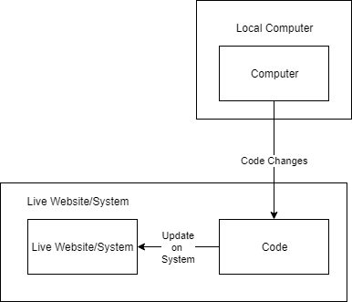
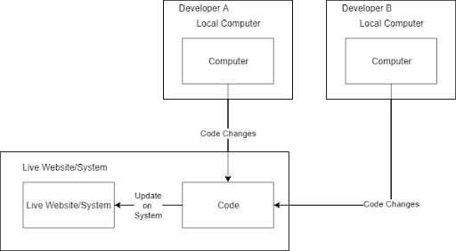
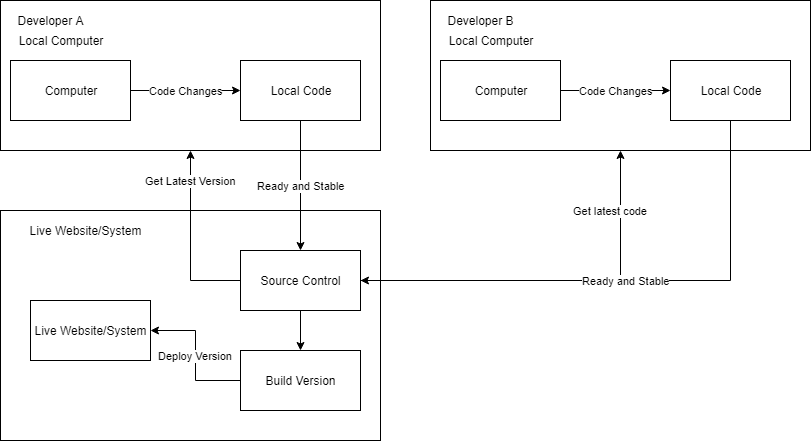
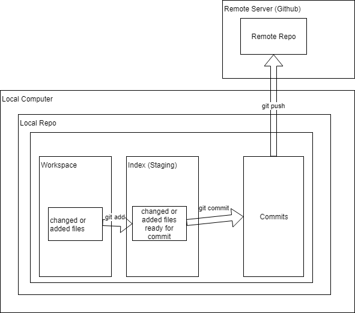
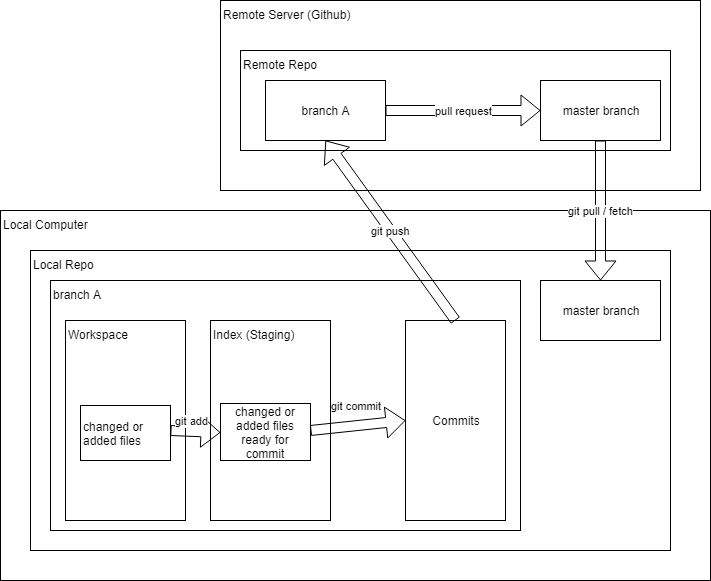

# Source Control Basics
[View in presentation form](https://docs.google.com/presentation/d/1o78CV_huVXuK9IWuLFwoLwQeXjwNLf_wGkF5tnlgrRY) 

## Topics Covered
* Source Control - What, Why, Benefits for Individuals and Teams
* What is Git? What is a commit? How to commit? Best practices when doing commits.
* Basic Git and Source Control Terms
* Basic Git Commands 
* Basic Git Workflow
* Exercise


# What is Source Control
**Source = Your Code
Control = What + Who + When + Why Changed**

Source control is the concept of tracking and controlling changes to your source code. A source control system (also known as SCM) tells the story of your project. Source control answers questions about changes, like these:
* What changed?
* When were the changes made?
* Who made the changes?
* Why were the changes made?

# Why Source Control?
Source control can be useful to individual coders, large teams, and everyone in between. Individuals use source control to save the history of their project so they can review changes over time and revert to a specific point in time if necessary.

## Development Workflow for Individuals
This is a typical individual development workflow without source control:



As you can see, the developer pushes code right to production.

There are some crucial problems with this pattern:
* Any mistakes go **right into production** - the work can't be tested anywhere except the developer's computer
* There's **no way to roll back** if something unexpected happens
* There's **no way to tell what changed** between one release and the next

### Why Use Source Control as an Individual?
* It becomes a backup of your work through time
* It enables understanding the history of changes - what was changed, when was it changed, and why
* It enables "snapshots" at two different points in time to be easily compared so you can find detailed differences
* It improves code stability via "branching" (we'll cover that in just a bit!)

## Development Workflow for Teams without Source Control
This is a typical team development workflow without source control:


As you can see, Developers A and B both make changes to the codebase on their local machines and then push to production.

There are some crucial problems with this pattern:
* Developer A can't work on the codebase while Developer B is working on it - only one person can make changes at a time!
* Any mistakes go **right into production** - and the more developers in the codebase, the more mistakes there will be
* Developers A and B are **working against each other** and have no way to work together
* There's **no way to roll back** if something unexpected happens
* There's **no way to tell what changed** between one release and the next, why it changed, or who changed it

## Development Workflow for Teams with Source Control
This is a typical team development workflow with source control:


As you can see, Developers A and B now save their changes in the source control system, which tracks who, what, when, and why. Since their code is now easily shared, they can create a build from the combined product of all their changes and test it in one or more environments.

### Why Use Source Control as a Team?
* Each dev can make changes without impacting other devs (via branching)
* The SCM's code versioning allows everyone to:
  * Share and identify changes easily
  * Detect and resolve change conflicts
  * Determine when someone else has made changes to code they've also changed
* Code history becomes clear - who, what, when, and why are always known
* Combined change product can be easily built and deployed to one or more environments - usually so more testing can be performed before going to production
* Production deployments can be rolled back to the previous version with confidence

# What is Git?
Git is a version control system. There are others, like Subversion, Team Foundation Server, Visual SourceSafe, and Mercurial. In a version control system, a set of file changes is called a "commit". The version control system treats every commit like a snapshot of the codebase at a given point in time.

Most version control systems have both a command-line interface and a GUI. [Sourcetree](https://www.sourcetreeapp.com/) is a popular GUI for Git, but in this tutorial we'll discuss the command-line interface.

## How to Make a Commit
With Git, it takes two actions to create a commit. First, we have to tell Git which files have changes we want to be part of the commit. We can do this with:

```git add filename```

Once we've told Git about all of the files we want to be part of the commit, we're ready to create the commit itself:

```git commit -m "Commit message"```

The commit message is a note that we'll use to help answer the **why?** question. The code history will show the commit message alongside the date and time, person making the commit ("committer"), and how many changes were made.

## Best Practices for Commits
A commit can contain one to a zillion changes and a project can have one to a zillion commits, so it's important to keep your commits organized. Here are some best practices for organizing your commits:
* Commit related changes together
  * Grouping related work into a single commit makes it easier to understand the *why* when we're looking at them later
* Commit often
  * Frequent commits forces us to make smaller commits and ensures work is being saved incrementally
  * It's easier to understand the commit history when the commits don't have as much code to look through
* Use descriptive commit messages
  * Descriptive messages help answer the *why* when we're looking at them later
  * Use messages such as "fixed the HTTP 404 error when help page is requested" instead of "fix help page"

# GitHub
## What is GitHub?
* A "hub" for Git projects
* Stores projects as "repositories"
* Provides user interface to view and contribute to repositories
* Controls access to public and private repositories

## Terms
|||
| ----------------------- | ----------------------------------------- |
| Repository (aka "repo") | Storage place for all your files and code |
| Local repository | Staging area on your local machine |
| Remote repository | Same as a local repository, but on a remote server such as GitHub, Bitbucket, etc |
| Clone | Make a copy of a remote repo on your computer (local repo) |
| Git Index | Holds local changes that will go in your next commit |
| Workspace | Local folder holding your source code |
| Git Push | Send commits from your local repo to the equivalent remote repo |
| Pull Request | A request that the project or branch maintainer **merge in** a set of code changes |

## Basic Git Commands
|||
| ----------------------- | ----------------------------------------- |
| `git add <file>` | Adds changed or new files to the index. Also called "staging" a file. |
| `git status` | Shows the current state of your workspace vs your local repository, including which files have changed. |
| `git push` | Pushes commits from your local repo to the equivalent remote repo. |
### "Undo" Commands
|||
| ----------------------- | ----------------------------------------- |
| `git reset <filename>` | Destroys local changes to `filename` |
| `git reset` | Blows away all local changes |
| `git revert <commit hash>` | Un-does the commit identified by `commit hash` by inverting it and committing the inverted changes |

## Basic Git Workflow
This is the typical development workflow with Git:


Let's go through this step-by-step.
1. Developer uses `git clone` to clone the remote repo into their local workspace. `git clone` creates a new, local repo on your machine that's a copy of the remote repo.
2. Developer makes changes by adding, updating, moving, or deleting files in the local workspace
3. Developer uses `git add <file>` to add them to the Git index and "stage" them, ready to become part of the next commit
4. Developer uses `git commit -m "Commit message"` to bundle all of the staged changes into a single commit to the local repository.
5. Developer uses `git push` to send all of the new commits in the local repository to the remote repository. At this point the local and remote repositories have identical code.


# Branching
## Topics Covered
* What is branching?
* Basic Branching Terms
* Basic Git Branching Commands
* Basic Branching Workflow

## What is a Branch?
A branch is a copy of your code. Branching allows us to have multiple sets of changes in progress at the same time without them impacting each other. For example, we can create a "stable" branch that only has fully-tested code from all developers. The stable branch is usually called "master". Each time we're ready to make changes, we can copy the `master` branch, make our changes, and then confirm our changes work with everyone else's changes before merging back up to the `master` branch via a **pull request**.

Once the changes have been tested and are ready to go, we create a **pull request** via GitHub. The pull request, known as a **PR**, tells the project maintainer that we want them to merge - or *pull* - our work into their project. **PR**s can be created across branches in the same remote repository or branches in different remote repositories.

When the maintainer "accepts" our **PR**, the changes are merged into the remote codebase and the PR is considered complete.

## Why Branch?
* Keeps `master` branch stable so un-tested and buggy code doesn't accidentally go into production
* Prevents bugs/un-tested/code not ready for production from impacting other developers' work
* Groups related work into a single unit, which makes it easier to understand
* Allows code experiments that are easy to discard or integrate into production
* Can capture snapshots of production releases showing what was in a given release
* Improves confidence that production hotfixes won't break production, even if development has continued since the last release
* Allows developers to share a unit of work with other developers before it's ready to go to production

## Basic Branching Terms
|                         |                                           |
| ----------------------- | ----------------------------------------- |
| Branch | Copy of the codebase that allows changes to be made in isolation from other branches. |
| `master` branch | Usually the "stable" branch where all fully-tested code lives. There are usually checks and balances that prevent unstable, or broken, code from making it into `master`. |
| HEAD | The tip, or **latest** commit in the current branch |

## Basic Branching Commands
|                         |                                           |
| ----------------------- | ----------------------------------------- |
| `git checkout -b <branchname>` | Creates a new local branch called `branchname` and switches to it |
| `git checkout <branchname>` | Switches to the existing local branch called `branchname` |
| `git fetch` | Retrieves, but does not **merge**, code and metadata changes from the remote repository. **Metadata** changes include things like the list of branches that exist in the remote repository. |
| `git pull` | Retrieves and automatically **merges** changes from the remote repository. |

## Basic Branching Workflow
This is the typical Git branching workflow:


Let's break it down step-by-step:
1. Developer **clones** the remote repository
2. Developer uses `git checkout -b <branchname>` to **create a new branch** that is a copy of the `master` branch
3. Developer adds, updates, moves, and deletes files
4. Developer uses `git add <file>` to **stage changes** for the next commit (for a single file) and `git add .` to **stage all changes** at once
5. Developer uses `git commit -m "Commit message"` to **create a new commit** with all the staged changes
6. Developer uses `git push` to **push all new commits** in the local repository's `branchname` branch to the remote repository's `branchname` branch. If `branchname` doesn't exist in the remote repository, it's automatically created.
7. Developer **creates a new pull request (PR)** from `branchname` to `master` so the project maintainer knows there are changes waiting to be merged in to `master`.
8. When the project maintainer **accepts the PR**, the changes in `branchname` are merged to `master`
9. The next time the developer does a `git pull`, the updates that are now in `master` are merged down to the local repository

## Branching Strategies
Branching strategies are often a topic of much discussion and consternation. There are quite a few branching strategies, and all of them have pros and cons. One strategy is to create branches prefixed with `/feature/` when working on new feature code and `/bug/` when working on a bugfix. This helps keep all of the branches organized, and the project maintainer will know whether they're merging a bugfix or a feature when reviewing PRs.

# Forking Workflow
**"Forking"** is when you create a copy of an entire remote repository, including all of its branches. Forking is a platform (GitHub, BitBucket, etc) feature. Developers create a fork when they:
* Want to make changes in a project where they aren't implicitly trusted, via a PR
* Want to experiment with a codebase they do not own

To create a fork, navigate to the GitHub page of the project you want to fork, [such as this one](https://github.com/steveperkins/dev-together-workshop-github-basics), and click the gray **Fork** button at the top of the page. This creates a copy of the entire project repository, but in your own account, where you're free to create branches, delete code, update files, etc. When you're ready to ask the project's maintainer to incorporate your changes, you'll create a pull request and they'll approve it.
